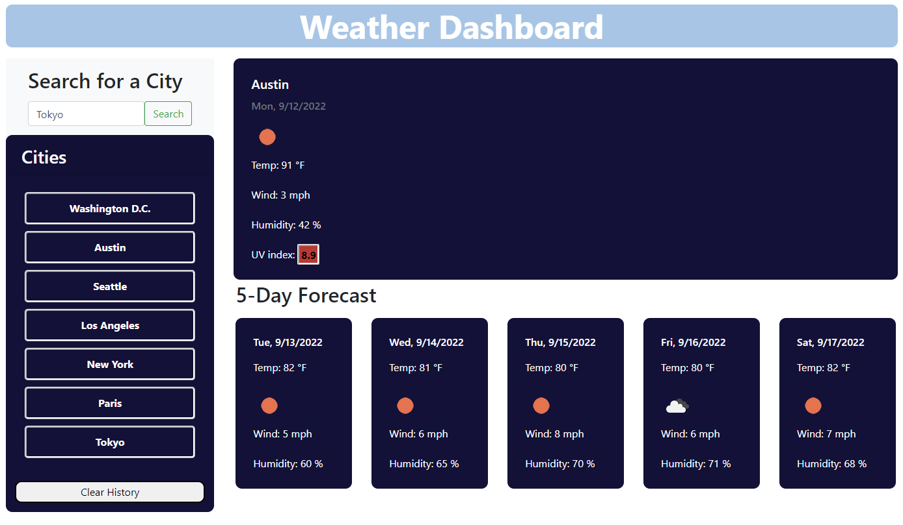

# weather_dashboard

This application consists of a Weather Dashboard

# Features:

1. Search weather by city - current and 5-day forecast weather conditions

2. Current weather conditions consists of:
    - City Name
    - Current Date
    - Icon representation of the current weather condition
    - Temperature
    - Wind Speed
    - Humidity
    - UV index - color coded to the following: favorable (green), moderate (orange) or severe (red).

3. 5-day forecast conditions - displays:
    - Date
    - Icon representation of the weather conditions
    - Temperature
    - Wind Speed
    - Humidity

4. Search history saved - the user can also access the city's weather conditions through the history.
    - Only unique values are saved to history.
    - Clear button included - the user can clear the history

## Preview

## Tools

- OpenWeather One Call API 1.0.: https://openweathermap.org/api/one-call-api. 
 According to Open Weather:

One Call API 1.0 Urls used:

 - Current Weather Url = "https://api.openweathermap.org/data/2.5/weather";
 - Forecast Url = "https://api.openweathermap.org/data/2.5/forecast";
 - Icon Url = "https://openweathermap.org/img/wn/";
 - UV index Url = "https://api.openweathermap.org/data/2.5/uvi";

## Sources:

## Link to application:

https://renatatims.github.io/weather_dashboard/

